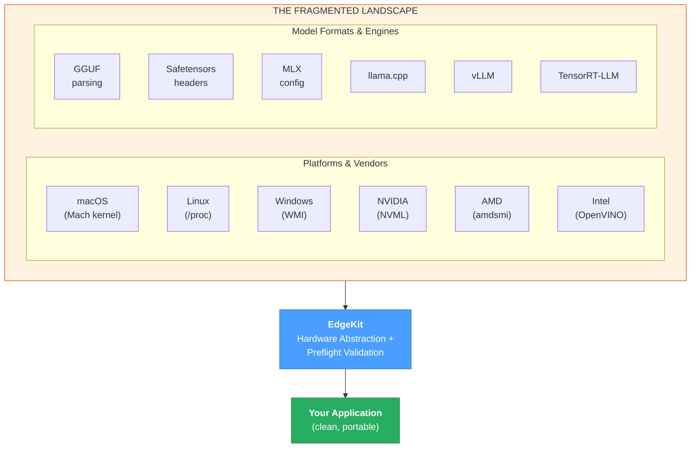

# EdgeKit

Hardware detection and memory validation for local LLM inference.

**Multiple devices, one interface.** Build local AI applications that run on M4 Macs, NVIDIA GPUs, AMD laptops, and Intel NPUs — without platform-specific code. Write once, deploy anywhere.



---

## What It Does

EdgeKit provides utilities for deploying LLMs on local hardware:

- **Hardware profiling** — CPU, GPU, RAM, NPU detection across macOS, Windows, and Linux
- **Memory validation** — Determine if a model will fit before attempting to load it
- **Build configuration** — Generate correct CMAKE flags for llama-cpp-python
- **Engine selection** — Recommend inference backends based on detected hardware

```python
from edgekit.hardware import system_info, recommended_engine
from edgekit.models import model_preflight

# Hardware detection
hw = system_info()
print(f"CPU: {hw.cpu.brand_raw}, Available RAM: {hw.ram.available_gb:.1f} GB")

# Engine recommendation
engine = recommended_engine()
print(f"Recommended: {engine.name} — {engine.reason}")

# Preflight check
result = model_preflight("mlx-community/Llama-3-8B-4bit", engine="mlx")
if result.can_load:
    print(f"Model fits. Safe context: {result.recommended_context:,} tokens")
else:
    print(f"Model won't fit: {result.message}")
```

---

## Why It Exists

Local LLM deployment involves infrastructure challenges that are separate from AI/ML concerns:

1. **Memory estimation is non-trivial** — A model's file size does not predict its runtime memory requirement. The KV cache grows with context length and varies by attention architecture (MHA vs GQA vs MLA).

2. **Hardware detection is fragmented** — Each platform (macOS/Linux/Windows) and vendor (NVIDIA/AMD/Intel/Apple) requires different APIs. "Available memory" has different semantics on unified memory vs discrete GPU systems.

3. **Build configuration is error-prone** — Installing llama-cpp-python with GPU acceleration requires hardware-specific CMAKE flags. Missing flags result in silent CPU fallback.

4. **Engine selection requires hardware knowledge** — Choosing between MLX, vLLM, llama.cpp, TensorRT-LLM, and OpenVINO depends on specific hardware capabilities.

Without a unifying layer, supporting multiple platforms means maintaining separate code paths: `pynvml` for NVIDIA, `amdsmi` for AMD, IOKit for Apple, WMI for Windows. Each new platform adds complexity to *your* application.

Doing this correctly requires expertise in hardware architectures, OS memory APIs, model attention mechanisms, quantization formats, and inference engine build systems. That's a lot of domain knowledge that has nothing to do with the application you're trying to build.

EdgeKit encodes this expertise so you don't have to acquire it. You write to one interface; EdgeKit handles the platform differences. The result: **portable local AI applications** that work anywhere.

For a deeper discussion of these problems and how EdgeKit approaches them, see [Why EdgeKit Exists](docs/WHY_EDGEKIT.md).

---

## Installation

```bash
# From PyPI (once published)
pip install edgekit

# From source
git clone https://github.com/yourusername/EdgeKit.git
cd EdgeKit
pip install -e .
```

---

## Core Functions

### `system_info()` — Hardware Detection

Returns a `HardwareProfile` with detected hardware specifications:

| Category | Fields | Description |
|----------|--------|-------------|
| CPU | `brand_raw`, `cores`, `instruction_sets` | Model, core count, extensions (AVX-512, NEON, AMX) |
| RAM | `total_gb`, `available_gb`, `details` | Memory stats, including macOS-specific breakdown |
| GPU | `nvidia`, `amd`, `apple`, `intel` | Per-vendor detection with VRAM and compute capability |
| NPU | `vendor`, `model_name`, `cores` | Neural processor detection |
| Storage | `primary_type` | SSD/NVMe vs HDD |

```python
hw = system_info()
print(hw.gpu.nvidia[0].compute_capability)  # 8.9 (RTX 4090)
print(hw.gpu.apple.gpu_cores)               # 20 (M4 Pro)
print(hw.cpu.instruction_sets)              # ["AVX2", "AVX-512"]
```

### `model_preflight()` — Memory Validation

Validates whether a model will fit in available memory before loading:

```python
result = model_preflight("TheBloke/Llama-2-7B-GGUF", engine="llama_cpp")

result.can_load          # True/False
result.recommended_context  # Safe context length
result.total_required_gb    # Memory needed
result.available_gb         # Memory available
result.message              # Human-readable explanation
```

The calculation accounts for:
- Model weights (with quantization-specific bits-per-weight)
- KV cache at the requested context length
- Backend-specific runtime overhead
- Safety buffers for OS and other processes

For remote HuggingFace models, metadata is extracted via HTTP Range requests (~500KB) rather than downloading the full model.

### `recommended_engine()` — Engine Selection

Returns the recommended inference backend for the detected hardware:

| Hardware | Recommended Engine | Reason |
|----------|-------------------|--------|
| Apple Silicon | MLX | Native Metal acceleration, unified memory |
| NVIDIA Ampere+ (CC ≥ 8.0) | TensorRT-LLM | FP8 support, optimized kernels |
| NVIDIA Turing/Volta (CC ≥ 7.0) | vLLM | PagedAttention, continuous batching |
| AMD ROCm | llama.cpp | Mature HIP backend |
| Intel GPU/NPU | OpenVINO | Intel-optimized stack |
| CPU (AVX-512/AVX2/NEON) | llama.cpp | Optimized SIMD kernels |

### `llama_cpp_args()` — Build Configuration

Generates CMAKE flags for llama-cpp-python based on detected hardware:

```python
from edgekit.build import llama_cpp_args

args = llama_cpp_args()
# ['-DGGML_METAL=ON', '-DGGML_BLAS=ON', '-DGGML_BLAS_VENDOR=Accelerate']
```

Handles platform-specific edge cases (Apple Silicon SVE bug, CUDA architecture detection, ROCm paths).

---

## Supported Platforms

| Platform | Hardware Detected | Notes |
|----------|-------------------|-------|
| macOS | Apple Silicon (M1–M4), Intel | 16KB page size handling, Mach kernel memory API |
| Linux | NVIDIA, AMD (ROCm), Intel | NVML, AMDSMI, OpenVINO integration |
| Windows | NVIDIA, Intel | WMI storage detection, CUDA version matching |

---

## Memory Estimation Details

EdgeKit calculates runtime memory as:

**Total = Weights + KV Cache + Overhead**

Key factors:
- **Quantization precision** — Q4_K_M uses 4.85 bits/weight, not 4.0. The difference determines fit vs failure for large models.
- **Attention architecture** — GQA and MLA reduce KV cache size by 4-8x compared to standard MHA.
- **Backend overhead** — MLX graph compilation, vLLM PagedAttention pre-allocation, llama.cpp initialization buffers.
- **Platform memory semantics** — macOS "available" memory includes evictable cached files; EdgeKit accounts for this.

---

## What EdgeKit Is Not

EdgeKit is not an inference engine. It does not load models or run inference.

EdgeKit is not a model repository. It inspects HuggingFace models but does not replace the Hub.

EdgeKit provides information and recommendations. Applications decide how to act on them.

---

## Documentation

- [**API Reference**](docs/USAGE.md) — Function signatures, schemas, return types
- [**Why EdgeKit Exists**](docs/WHY_EDGEKIT.md) — Problem space and design rationale
- [**Hardware Profiling Internals**](docs/HARDWARE_PROFILING_INTERNALS.md) — Platform-specific detection details
- [**Model Preflight Internals**](docs/MODEL_PREFLIGHT_INTERNALS.md) — Memory estimation algorithms
- [**Philosophy**](docs/PHILOSOPHY.md) — Design principles

## Examples

The `examples/` directory contains runnable scripts:

- `test_systeminfo.py` — Hardware detection
- `test_model_preflight.py` — Memory validation
- `test_optimal_engine.py` — Engine recommendation
- `auto_install_llama_cpp.py` — Build configuration
